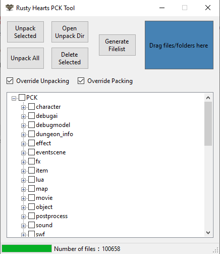

# Rusty Hearts PCK Tool

 <a href="https://github.com/JuniorDark/RustyHearts-PCKTool/releases">

A C# Windows Forms application that allows extracting and repacking files from the Rusty Hearts game archives (PCK files).

## Getting Started
To get started with this tool, simply download the latest release from the GitHub repository.

Make sure the tool is placed in the game directory before running it. Once the tool is launched, it will display a tree view of the files in the archives.

### Extracting Files
To extract files, select the files or folders you want to extract in the tree view and click the "Unpack Selected" button. The selected files will be extracted to the PCKOutput folder in the same directory as the PCK archive.

### Packing Files
To pack files, select the files or folders you want to replace and drag and drop in the blue box. When packing remember to keep the same structure as the PCK.

## Usage
1. Place the program in the game directory and run it.
2. The program will read the PCK filelist (f00X.dat) and create a tree structure.
3. Select the files to be extracted by checking the corresponding checkboxes.
4. Click the "Unpack Selected" button to extract the selected files.
5. Click the "Unpack All" button to extract all files.

## Prerequisites for Building Locally/Development
The tool is built in .NET 7 and as such, the packages listed below are required to create a local and development build of the tool. Furthermore, it uses many submodules and packages outside of this, which will automatically be loaded when the user sets up a local environment of the application.
* Visual Studio 2022 (Any Edition - 17.4 or later)
* Windows 10 SDK (10.0.19043.0) or Windows 11 SDK (10.0.22000.0) via Visual Studio Installer
* .NET: [.NET Core 7 SDK (7.0.100 or later)](https://dotnet.microsoft.com/en-us/download/dotnet/7.0)

## System Requirements for Ready-to-use build
* OS: Windows 10 1809 Update (build 17763) or later / Windows 11 (Any builds)
* Architecture: x64/AMD64

## Preview

## License
This project is licensed under the terms found in [`LICENSE-0BSD`](LICENSE).

## Contributing
Contributions from the community are welcome! If you encounter a bug or have a feature request, please submit an issue on GitHub. If you would like to contribute code, please fork the repository and submit a pull request.

## FAQ
* Q: How do I report a bug?
  * A: Please submit an issue on GitHub with a detailed description of the bug and steps to reproduce it.
* Q: How do I request a new feature?
  * A: Please submit an issue on GitHub with a detailed description of the feature and why it would be useful.
* Q: How do I contribute code?
  * A: Please fork the repository, make your changes, and submit a pull request.

## Credits
The following third-party libraries, tools, and resources are used in this project:
* [Newtonsoft.Json](https://www.nuget.org/packages/Newtonsoft.Json)

## Support
If you need help with the tool, please submit an issue on GitHub.
